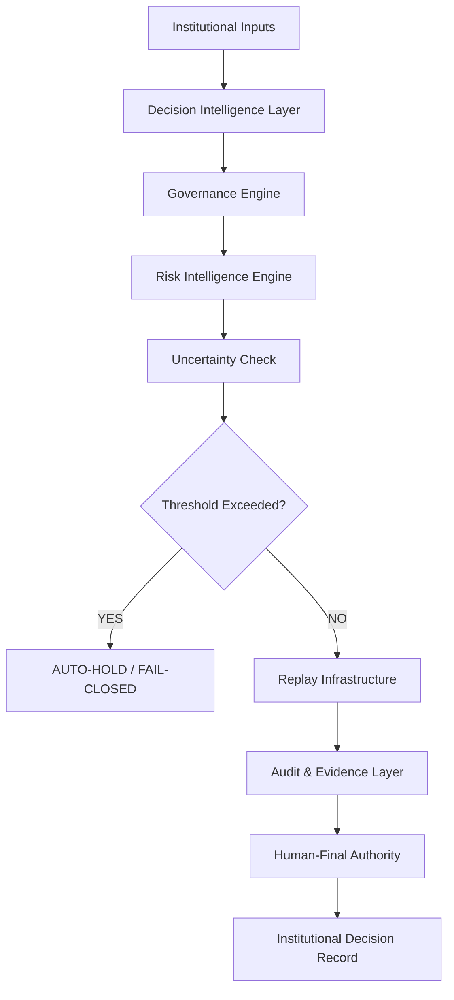

# AICOS OS — Governance Architecture

```mermaid
flowchart TD

    A[Institutional Inputs] --> B[Decision Intelligence Layer]

    B --> C[Governance Engine]

    C --> D[Risk Intelligence Engine]

    D --> E[Uncertainty Check]

    E --> F{Threshold Exceeded?}

    F -- YES --> G[AUTO-HOLD / FAIL-CLOSED]

    F -- NO --> H[Replay Infrastructure]

    H --> I[Audit & Evidence Layer]

    I --> J[Human-Final Authority]

    J --> K[Institutional Decision Record]
```
